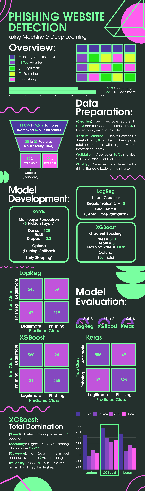

---

## 🎯 Objective

Develop and compare three classification models — **Logistic Regression**, **XGBoost**, and a **Neural Network (Keras)** — to automatically detect phishing websites based on 30 expert-engineered categorical features.  
The goal is to achieve high precision (minimize false positives) and high recall (minimize false negatives), balancing user experience and security in real-world deployment.

---

## 📊 Dataset Overview

- **Dataset:** [Phishing Website Detection (UCI)](https://archive.ics.uci.edu/dataset/327/phishing+websites)
- **Size:** 11,055 websites 
- **Features:** 30 categorical features derived from URL structure, domain properties, SSL status, and page content.  
- **Encoding:** Each feature is scored as:  
  - `1` = Red flag (phishing indicator)  
  - `0` = Neutral / suspicious  
  - `-1` = Green flag (legitimate indicator)  
- **Target:** Binary classification — `0` = Legitimate, `1` = Phishing  

> 💡 **Why this matters:** Unlike most datasets, this one uses **expert-labeled features** — not raw text or HTML. This reflects real-world detection systems used by cybersecurity firms.

---

## 🔍 Methodology

### 1. **Data Preprocessing**
- Decoded byte-string features to UTF-8 and converted to numeric types.
- Removed **5,206 duplicate rows** to ensure data integrity.
- Validated that all features lie within the expected range {-1, 0, 1} and target is binary {0, 1}.

### 2. **Feature Analysis**
- **Visual analysis** of feature distributions by class revealed strong discriminative power in:
  - `SSLfinal_State`: Legitimate sites rarely use SSL; phishing sites often fake it.
  - `URL_of_Anchor`: Phishing sites frequently link to external domains.
  - `Prefix_Suffix`: The presence of a prefix or suffix in a domain name always indicates phishing.
- **Mutual Information (MI)** quantified feature importance — confirmed top 3 features above.
- **Cramér’s V** identified high correlations between features (e.g., `Shortining_Service` ↔ `double_slash_redirecting`).
- **Selected features for removal** based on MI and V-Cramer:  
  `double_slash_redirecting`, `port`, `popUpWindow`  
  → **Reduced feature space from 30 to 27** without loss of predictive power.

### 3. **Model Training & Optimization**
All models were trained on a **stratified 80/20 split** of cleaned data.  
Hyperparameters were optimized using **cross-validation** (Logistic Regression) and **Bayesian optimization with Optuna** (XGBoost, Keras).

| Model | Optimization Method | Training Time (sec) |
|-------|---------------------|---------------------|
| Logistic Regression | GridSearchCV (5-fold CV) | 2.40 |
| XGBoost | Optuna (50 trials) | 0.51 |
| Keras (Neural Network) | Optuna (50 trials) | 43.91 |

### 4. **Evaluation**
Models were evaluated on an **unseen test set (1,170 samples)** using:
- ROC AUC (overall discriminative power)
- Precision, Recall, F1-score (practical performance)
- Confusion matrices (error analysis)

---

## 📈 Results on Test Set

| Model | ROC AUC | Precision | Recall | F1-score | Training Time (sec) |
|-------|---------|-----------|--------|----------|---------------------|
| **XGBoost** | **0.9932** | **0.9571** | **0.9452** | **0.9511** | **0.51** |
| Keras | 0.9738 | 0.9152 | 0.9346 | 0.9248 | 43.91 |
| Logistic Regression | 0.9735 | 0.8979 | 0.9170 | 0.9073 | 2.40 |

### 🔑 Key Insights

- ✅ **XGBoost is the clear winner**:  
  Highest **ROC AUC**, highest **precision**, fastest training — and **equal recall** to Keras.  
  This means:  
  > 🔹 It catches **94.5% of phishing sites** (low false negatives).  
  > 🔹 It **only mislabels 2% of legitimate sites** as phishing (lowest false positives).  

- 🚫 **Keras** matches XGBoost in recall but has **~5% more false positives** — a critical flaw in production (users hate blocked legitimate sites).

- ⚖️ **Logistic Regression** performs well as a baseline, but is outperformed by both advanced models.

- 📊 **Confusion matrices confirm**:  
  XGBoost has the **fewest false positives (24)** — meaning it’s safest for end-users.  
  Keras has **49 false positives** — nearly double — making it less suitable for real-time blocking.

---
